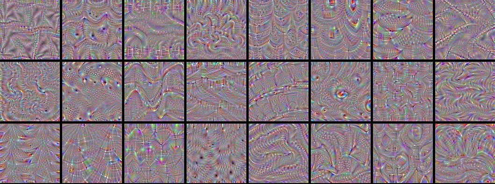
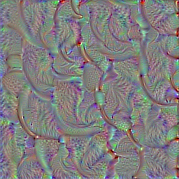
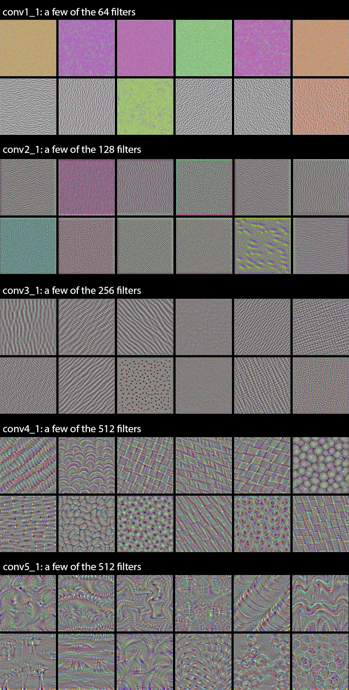
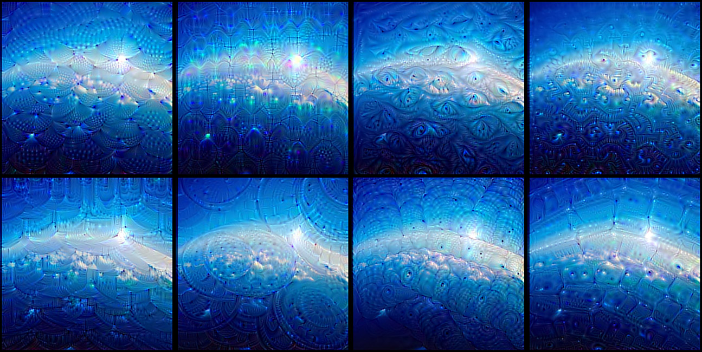
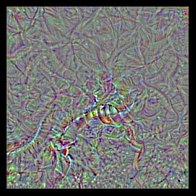
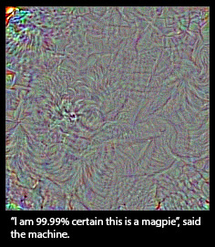

# CNN眼中的世界：利用Keras解释CNN的滤波器

## 文章信息
<font color='#FF0000'>本文地址：[<font color='#FF0000'>http://blog.keras.io/how-convolutional-neural-networks-see-the-world.html</font>](http://blog.keras.io/how-convolutional-neural-networks-see-the-world.html)

本文作者：Francois Chollet
</font>


### 使用Keras探索卷积网络的滤波器

本文中我们将利用Keras观察CNN到底在学些什么，它是如何理解我们送入的训练图片的。我们将使用Keras来对滤波器的激活值进行可视化。本文使用的神经网络是VGG-16，数据集为ImageNet。本文的代码可以在<font color='#FF0000'>[<font color='#FF0000'>github</font>](https://github.com/fchollet/keras/blob/master/examples/conv_filter_visualization.py)</font>找到



VGG-16又称为OxfordNet，是由牛津[<font color='#FF0000'>视觉几何组（Visual Geometry Group）</font>](http://www.robots.ox.ac.uk/~vgg/)开发的卷积神经网络结构。该网络赢得了[<font color='#FF0000'>ILSVR（ImageNet）2014</font>](http://www.robots.ox.ac.uk/~vgg/research/very_deep/)的冠军。时至今日，VGG仍然被认为是一个杰出的视觉模型——尽管它的性能实际上已经被后来的Inception和ResNet超过了。

Lorenzo Baraldi将Caffe预训练好的VGG16和VGG19模型转化为了Keras权重文件，所以我们可以简单的通过载入权重来进行实验。该权重文件可以在[<font color='#FF0000'>这里</font>](https://gist.github.com/baraldilorenzo/07d7802847aaad0a35d3)下载。国内的同学需要自备梯子。（这里是一个网盘保持的vgg16：[<font color='#FF0000'>http://files.heuritech.com/weights/vgg16_weights.h5</font>](http://files.heuritech.com/weights/vgg16_weights.h5)赶紧下载，网盘什么的不知道什么时候就挂了。）

首先，我们在Keras中定义VGG网络的结构：

```python
from keras.models import Sequential
from keras.layers import Convolution2D, ZeroPadding2D, MaxPooling2D

img_width, img_height = 128, 128

# build the VGG16 network
model = Sequential()
model.add(ZeroPadding2D((1, 1), batch_input_shape=(1, 3, img_width, img_height)))
first_layer = model.layers[-1]
# this is a placeholder tensor that will contain our generated images
input_img = first_layer.input

# build the rest of the network
model.add(Convolution2D(64, 3, 3, activation='relu', name='conv1_1'))
model.add(ZeroPadding2D((1, 1)))
model.add(Convolution2D(64, 3, 3, activation='relu', name='conv1_2'))
model.add(MaxPooling2D((2, 2), strides=(2, 2)))

model.add(ZeroPadding2D((1, 1)))
model.add(Convolution2D(128, 3, 3, activation='relu', name='conv2_1'))
model.add(ZeroPadding2D((1, 1)))
model.add(Convolution2D(128, 3, 3, activation='relu', name='conv2_2'))
model.add(MaxPooling2D((2, 2), strides=(2, 2)))

model.add(ZeroPadding2D((1, 1)))
model.add(Convolution2D(256, 3, 3, activation='relu', name='conv3_1'))
model.add(ZeroPadding2D((1, 1)))
model.add(Convolution2D(256, 3, 3, activation='relu', name='conv3_2'))
model.add(ZeroPadding2D((1, 1)))
model.add(Convolution2D(256, 3, 3, activation='relu', name='conv3_3'))
model.add(MaxPooling2D((2, 2), strides=(2, 2)))

model.add(ZeroPadding2D((1, 1)))
model.add(Convolution2D(512, 3, 3, activation='relu', name='conv4_1'))
model.add(ZeroPadding2D((1, 1)))
model.add(Convolution2D(512, 3, 3, activation='relu', name='conv4_2'))
model.add(ZeroPadding2D((1, 1)))
model.add(Convolution2D(512, 3, 3, activation='relu', name='conv4_3'))
model.add(MaxPooling2D((2, 2), strides=(2, 2)))

model.add(ZeroPadding2D((1, 1)))
model.add(Convolution2D(512, 3, 3, activation='relu', name='conv5_1'))
model.add(ZeroPadding2D((1, 1)))
model.add(Convolution2D(512, 3, 3, activation='relu', name='conv5_2'))
model.add(ZeroPadding2D((1, 1)))
model.add(Convolution2D(512, 3, 3, activation='relu', name='conv5_3'))
model.add(MaxPooling2D((2, 2), strides=(2, 2)))

# get the symbolic outputs of each "key" layer (we gave them unique names).
layer_dict = dict([(layer.name, layer) for layer in model.layers])
```

注意我们不需要全连接层，所以网络就定义到最后一个卷积层为止。使用全连接层会将输入大小限制为224×224，即ImageNet原图片的大小。这是因为如果输入的图片大小不是224×224，在从卷积过度到全链接时向量的长度与模型指定的长度不相符。

下面，我们将预训练好的权重载入模型，一般而言我们可以通过```model.load_weights()```载入，但这里我们只载入一部分参数，如果使用该方法的话，模型和参数形式就不匹配了。所以我们需要手工载入：

```python
import h5py

weights_path = 'vgg16_weights.h5'

f = h5py.File(weights_path)
for k in range(f.attrs['nb_layers']):
    if k >= len(model.layers):
        # we don't look at the last (fully-connected) layers in the savefile
        break
    g = f['layer_{}'.format(k)]
    weights = [g['param_{}'.format(p)] for p in range(g.attrs['nb_params'])]
    model.layers[k].set_weights(weights)
f.close()
print('Model loaded.')
```

下面，我们要定义一个损失函数，这个损失函数将用于最大化某个指定滤波器的激活值。以该函数为优化目标优化后，我们可以真正看一下使得这个滤波器激活的究竟是些什么东西。

现在我们使用Keras的后端来完成这个损失函数，这样这份代码不用修改就可以在TensorFlow和Theano之间切换了。TensorFlow在CPU上进行卷积要块的多，而目前为止Theano在GPU上进行卷积要快一些。

```python
from keras import backend as K

layer_name = 'conv5_1'
filter_index = 0  # can be any integer from 0 to 511, as there are 512 filters in that layer

# build a loss function that maximizes the activation
# of the nth filter of the layer considered
layer_output = layer_dict[layer_name].output
loss = K.mean(layer_output[:, filter_index, :, :])

# compute the gradient of the input picture wrt this loss
grads = K.gradients(loss, input_img)[0]

# normalization trick: we normalize the gradient
grads /= (K.sqrt(K.mean(K.square(grads))) + 1e-5)

# this function returns the loss and grads given the input picture
iterate = K.function([input_img], [loss, grads])
```

注意这里有个小trick，计算出来的梯度进行了正规化，使得梯度不会过小或过大。这种正规化能够使梯度上升的过程平滑进行。

根据刚刚定义的函数，现在可以对某个滤波器的激活值进行梯度上升。

```python
import numpy as np

# we start from a gray image with some noise
input_img_data = np.random.random((1, 3, img_width, img_height)) * 20 + 128.
# run gradient ascent for 20 steps
for i in range(20):
    loss_value, grads_value = iterate([input_img_data])
    input_img_data += grads_value * step
```

使用TensorFlow时，这个操作大概只要几秒。

然后我们可以提取出结果，并可视化：

```python
from scipy.misc import imsave

# util function to convert a tensor into a valid image
def deprocess_image(x):
    # normalize tensor: center on 0., ensure std is 0.1
    x -= x.mean()
    x /= (x.std() + 1e-5)
    x *= 0.1

    # clip to [0, 1]
    x += 0.5
    x = np.clip(x, 0, 1)

    # convert to RGB array
    x *= 255
    x = x.transpose((1, 2, 0))
    x = np.clip(x, 0, 255).astype('uint8')
    return x

img = input_img_data[0]
img = deprocess_image(img)
imsave('%s_filter_%d.png' % (layer_name, filter_index), img)
```
这里是第5卷基层第0个滤波器的结果：



### 可视化所有的滤波器

下面我们系统的可视化一下各个层的各个滤波器结果，看看CNN是如何对输入进行逐层分解的。

第一层的滤波器主要完成方向、颜色的编码，这些颜色和方向与基本的纹理组合，逐渐生成复杂的形状。

可以将每层的滤波器想为基向量，这些基向量一般是过完备的。基向量可以将层的输入紧凑的编码出来。滤波器随着其利用的空域信息的拓宽而更加精细和复杂，



可以观察到，很多滤波器的内容其实是一样的，只不过旋转了一个随机的的角度（如90度）而已。这意味着我们可以通过使得卷积滤波器具有旋转不变性而显著减少滤波器的数目，这是一个有趣的研究方向。

令人震惊的是，这种旋转的性质在高层的滤波器中仍然可以被观察到。如Conv4_1


### Deep Dream（nightmare）

另一个有趣的事儿是，如果我们把刚才的随机噪声图片替换为有意义的照片，结果就变的更好玩了。这就是去年由Google提出的Deep Dream。通过选择特定的滤波器组合，我们可以获得一些很有意思的结果。如果你对此感兴趣，可以参考Keras的例子
[<font color='#FF0000'>Deep Dream</font>](https://github.com/fchollet/keras/blob/master/examples/deep_dream.py)和Google的博客[<font color='#FF0000'>Google blog post</font>](googleresearch.blogspot.com/2015/06/inceptionism-going-deeper-into-neural.html)（墙）



### 愚弄神经网络

如果我们添加上VGG的全连接层，然后试图最大化某个指定类别的激活值呢？你会得到一张很像该类别的图片吗？让我们试试。

这种情况下我们的损失函数长这样：

```python
layer_output = model.layers[-1].get_output()
loss = K.mean(layer_output[:, output_index])
```

比方说我们来最大化输出下标为65的那个类，在ImageNet里，这个类是蛇。很快，我们的损失达到了0.999，即神经网络有99.9%的概率认为我们生成的图片是一条海蛇，它长这样：



不太像呀，换个类别试试，这次选喜鹊类（第18类）



OK，我们的网络认为是喜鹊的东西看起来完全不是喜鹊，往好了说，这个图里跟喜鹊相似的，也不过就是一些局部的纹理，如羽毛，嘴巴之类的。那么，这就意味着卷积神经网络是个很差的工具吗？当然不是，我们按照一个特定任务来训练它，它就会在那个任务上表现的不错。但我们不能有网络“理解”某个概念的错觉。我们不能将网络人格化，它只是工具而已。比如一条狗，它能识别其为狗只是因为它能以很高的概率将其正确分类而已，而不代表它理解关于“狗”的任何外延。

### 革命尚未成功，同志仍需努力

所以，神经网络到底理解了什么呢？我认为有两件事是它们理解的。

其一，神经网络理解了如何将输入空间解耦为分层次的卷积滤波器组。其二，神经网络理解了从一系列滤波器的组合到一系列特定标签的概率映射。神经网络学习到的东西完全达不到人类的“看见”的意义，从科学的的角度讲，这当然也不意味着我们已经解决了计算机视觉的问题。想得别太多，我们才刚刚踩上计算机视觉天梯的第一步。

有些人说，卷积神经网络学习到的对输入空间的分层次解耦模拟了人类视觉皮层的行为。这种说法可能对也可能不对，但目前未知我们还没有比较强的证据来承认或否认它。当然，有些人可以期望人类的视觉皮层就是以类似的方式学东西的，某种程度上讲，这是对我们视觉世界的自然解耦（就像傅里叶变换是对周期声音信号的一种解耦一样自然）【译注：这里是说，就像声音信号的傅里叶变换表达了不同频率的声音信号这种很自然很物理的理解一样，我们可能会认为我们对视觉信息的识别就是分层来完成的，圆的是轮子，有四个轮子的是汽车，造型炫酷的汽车是跑车，像这样】。但是，人类对视觉信号的滤波、分层次、处理的本质很可能和我们弱鸡的卷积网络完全不是一回事。视觉皮层不是卷积的，尽管它们也分层，但那些层具有皮质列的结构，而这些结构的真正目的目前还不得而知，这种结构在我们的人工神经网络中还没有出现（尽管乔大帝Geoff Hinton正在在这个方面努力）。此外，人类有比给静态图像分类的感知器多得多的视觉感知器，这些感知器是连续而主动的，不是静态而被动的，这些感受器还被如眼动等多种机制复杂控制。

下次有风投或某知名CEO警告你要警惕我们深度学习的威胁时，想想上面说的吧。今天我们是有更好的工具来处理复杂的信息了，这很酷，但归根结底它们只是工具，而不是生物。它们做的任何工作在哪个宇宙的标准下都不够格称之为“思考”。在一个石头上画一个笑脸并不会使石头变得“开心”，尽管你的灵长目皮质会告诉你它很开心。

总而言之，卷积神经网络的可视化工作是很让人着迷的，谁能想到仅仅通过简单的梯度下降法和合理的损失函数，加上大规模的数据库，就能学到能很好解释复杂视觉信息的如此漂亮的分层模型呢。深度学习或许在实际的意义上并不智能，但它仍然能够达到几年前任何人都无法达到的效果。现在，如果我们能理解为什么深度学习如此有效，那……嘿嘿:)

@fchollet, 2016年1月


