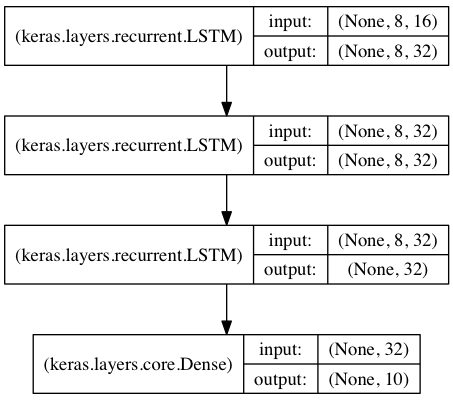
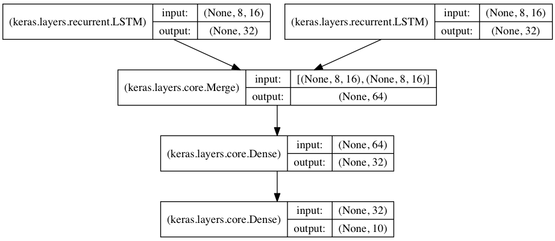

#快速开始Sequential模型

```Sequential```是多个网络层的线性堆叠

可以通过向```Sequential```模型传递一个layer的list来构造该模型：

```python
from keras.models import Sequential
from keras.layers import Dense, Activation

model = Sequential([
Dense(32, input_dim=784),
Activation('relu'),
Dense(10),
Activation('softmax'),
])
```

也可以通过```.add()```方法一个个的将layer加入模型中：

```python
model = Sequential()
model.add(Dense(32, input_dim=784))
model.add(Activation('relu'))
```

***
	
## 指定输入数据的shape

模型需要知道输入数据的shape，因此，```Sequential```的第一层需要接受一个关于输入数据shape的参数，后面的各个层则可以自动的推导出中间数据的shape，因此不需要为每个层都指定这个参数。有几种方法来为第一层指定输入数据的shape

* 传递一个```input_shape```的关键字参数给第一层，```input_shape```是一个tuple类型的数据，其中也可以填入```None```，如果填入```None```则表示此位置可能是任何正整数。数据的batch大小不应包含在其中。

* 传递一个```batch_input_shape```的关键字参数给第一层，该参数包含数据的batch大小。该参数在指定固定大小batch时比较有用，例如在stateful RNNs中。事实上，Keras在内部会通过添加一个None将input_shape转化为batch_input_shape

* 有些2D层，如```Dense```，支持通过指定其输入维度```input_dim```来隐含的指定输入数据shape。一些3D的时域层支持通过参数```input_dim```和```input_length```来指定输入shape。

下面的三个指定输入数据shape的方法是严格等价的：

```python
model = Sequential()
model.add(Dense(32, input_shape=(784,)))
```

```python
model = Sequential()
model.add(Dense(32, batch_input_shape=(None, 784)))
# note that batch dimension is "None" here,
# so the model will be able to process batches of any size.</pre>
```

```python
model = Sequential()
model.add(Dense(32, input_dim=784))
```

下面三种方法也是严格等价的：

```python
model = Sequential()
model.add(LSTM(32, input_shape=(10, 64)))
```

```python
model = Sequential()
model.add(LSTM(32, batch_input_shape=(None, 10, 64)))
```

```python
model = Sequential()
model.add(LSTM(32, input_length=10, input_dim=64))
```

***
	
## Merge层

多个```Sequential```可经由一个Merge层合并到一个输出。Merge层的输出是一个可以被添加到新 ```Sequential```的层对象。下面这个例子将两个Sequential合并到一起：

```python
from keras.layers import Merge

left_branch = Sequential()
left_branch.add(Dense(32, input_dim=784))

right_branch = Sequential()
right_branch.add(Dense(32, input_dim=784))

merged = Merge([left_branch, right_branch], mode='concat')

final_model = Sequential()
final_model.add(merged)
final_model.add(Dense(10, activation='softmax'))
```
	


Merge层支持一些预定义的合并模式，包括：

* ```sum```\(defualt\):逐元素相加
* ```concat```:张量串联，可以通过提供```concat_axis```的关键字参数指定按照哪个轴进行串联
* ```mul```：逐元素相乘
* ```ave```：张量平均
* ```dot```：张量相乘，可以通过```dot_axis```关键字参数来指定要消去的轴
* ```cos```：计算2D张量（即矩阵）中各个向量的余弦距离

这个两个分支的模型可以通过下面的代码训练:
```python
final_model.compile(optimizer='rmsprop', loss='categorical_crossentropy')
final_model.fit([input_data_1, input_data_2], targets)  # we pass one data array per model input
```

也可以为Merge层提供关键字参数```mode```，以实现任意的变换，例如：

```python
merged = Merge([left_branch, right_branch], mode=lambda x: x[0] - x[1])
```
	
现在你已经学会定义几乎任何Keras的模型了，对于不能通过Sequential和Merge组合生成的复杂模型，可以参考[<font color=#FF0000>泛型模型API</font>](functional_API.md)

***

## 编译

在训练模型之前，我们需要通过```compile```来对学习过程进行配置。```compile```接收三个参数：

* 优化器optimizer：该参数可指定为已预定义的优化器名，如```rmsprop```、```adagrad```，或一个```Optimizer```类的对象，详情见[<font color=#FF0000>optimizers</font>](../other/optimizers.md)

* 损失函数loss：该参数为模型试图最小化的目标函数，它可为预定义的损失函数名，如```categorical_crossentropy```、```mse```，也可以为一个损失函数。详情见[<font color=#FF0000>objectives</font>](../other/objectives.md)

* 指标列表metrics：对分类问题，我们一般将该列表设置为```metrics=['accuracy']```。指标可以是一个预定义指标的名字（目前仅支持```accuracy```），也可以是一个一般的函数。
	

```python
# for a multi-class classification problem
model.compile(optimizer='rmsprop',
loss='categorical_crossentropy',
metrics=['accuracy'])

# for a binary classification problem
model.compile(optimizer='rmsprop',
loss='binary_crossentropy',
metrics=['accuracy'])

# for a mean squared error regression problem
model.compile(optimizer='rmsprop',
loss='mse')
```

***

## 训练

Keras以Numpy数组作为输入数据和标签的数据类型。训练模型一般使用```fit```函数，该函数的详情见[<font color=#FF0000>这里</font>](../models/sequential.md)。下面是一些例子。

```python
# for a single-input model with 2 classes (binary):
model = Sequential()
model.add(Dense(1, input_dim=784, activation='sigmoid'))
model.compile(optimizer='rmsprop',
              loss='binary_crossentropy',
              metrics=['accuracy'])

# generate dummy data
import numpy as np
data = np.random.random((1000, 784))
labels = np.random.randint(2, size=(1000, 1))

# train the model, iterating on the data in batches
# of 32 samples
model.fit(data, labels, nb_epoch=10, batch_size=32)
```

```python
# for a multi-input model with 10 classes:

left_branch = Sequential()
left_branch.add(Dense(32, input_dim=784))

right_branch = Sequential()
right_branch.add(Dense(32, input_dim=784))

merged = Merge([left_branch, right_branch], mode='concat')

model = Sequential()
model.add(merged)
model.add(Dense(10, activation='softmax'))

model.compile(optimizer='rmsprop',
              loss='categorical_crossentropy',
              metrics=['accuracy'])

# generate dummy data
import numpy as np
from keras.utils.np_utils import to_categorical
data_1 = np.random.random((1000, 784))
data_2 = np.random.random((1000, 784))

# these are integers between 0 and 9
labels = np.random.randint(10, size=(1000, 1))
# we convert the labels to a binary matrix of size (1000, 10)
# for use with categorical_crossentropy
labels = to_categorical(labels, 10)

# train the model
# note that we are passing a list of Numpy arrays as training data
# since the model has 2 inputs
model.fit([data_1, data_2], labels, nb_epoch=10, batch_size=32)
```

***

## 例子

这里是一些帮助你开始的例子

在Keras代码包的examples文件夹中，你将找到使用真实数据的示例模型：

* CIFAR10 小图片分类：使用CNN和实时数据提升
* IMDB 电影评论观点分类：使用LSTM处理成序列的词语
* Reuters（路透社）新闻主题分类：使用多层感知器（MLP）
* MNIST手写数字识别：使用多层感知器和CNN
* 字符级文本生成：使用LSTM
...

### 基于多层感知器的softmax多分类：

```python
from keras.models import Sequential
from keras.layers import Dense, Dropout, Activation
from keras.optimizers import SGD

model = Sequential()
# Dense(64) is a fully-connected layer with 64 hidden units.
# in the first layer, you must specify the expected input data shape:
# here, 20-dimensional vectors.
model.add(Dense(64, input_dim=20, init='uniform'))
model.add(Activation('tanh'))
model.add(Dropout(0.5))
model.add(Dense(64, init='uniform'))
model.add(Activation('tanh'))
model.add(Dropout(0.5))
model.add(Dense(10, init='uniform'))
model.add(Activation('softmax'))

sgd = SGD(lr=0.1, decay=1e-6, momentum=0.9, nesterov=True)
model.compile(loss='categorical_crossentropy',
			  optimizer=sgd,
			  metrics=['accuracy'])

model.fit(X_train, y_train,
		  nb_epoch=20,
		  batch_size=16)
score = model.evaluate(X_test, y_test, batch_size=16)	
```

### 相似MLP的另一种实现：

```python	
model = Sequential()
model.add(Dense(64, input_dim=20, activation='relu'))
model.add(Dropout(0.5))
model.add(Dense(64, activation='relu'))
model.add(Dropout(0.5))
model.add(Dense(10, activation='softmax'))

model.compile(loss='categorical_crossentropy',
			  optimizer='adadelta',
			  metrics=['accuracy'])
```

### 用于二分类的多层感知器：

```python
model = Sequential()
model.add(Dense(64, input_dim=20, init='uniform', activation='relu'))
model.add(Dropout(0.5))
model.add(Dense(64, activation='relu'))
model.add(Dropout(0.5))
model.add(Dense(1, activation='sigmoid'))

model.compile(loss='binary_crossentropy',
			  optimizer='rmsprop',
			  metrics=['accuracy'])
```

### 类似VGG的卷积神经网络：

```python
from keras.models import Sequential
from keras.layers import Dense, Dropout, Activation, Flatten
from keras.layers import Convolution2D, MaxPooling2D
from keras.optimizers import SGD

model = Sequential()
# input: 100x100 images with 3 channels -> (3, 100, 100) tensors.
# this applies 32 convolution filters of size 3x3 each.
model.add(Convolution2D(32, 3, 3, border_mode='valid', input_shape=(3, 100, 100)))
model.add(Activation('relu'))
model.add(Convolution2D(32, 3, 3))
model.add(Activation('relu'))
model.add(MaxPooling2D(pool_size=(2, 2)))
model.add(Dropout(0.25))

model.add(Convolution2D(64, 3, 3, border_mode='valid'))
model.add(Activation('relu'))
model.add(Convolution2D(64, 3, 3))
model.add(Activation('relu'))
model.add(MaxPooling2D(pool_size=(2, 2)))
model.add(Dropout(0.25))

model.add(Flatten())
# Note: Keras does automatic shape inference.
model.add(Dense(256))
model.add(Activation('relu'))
model.add(Dropout(0.5))

model.add(Dense(10))
model.add(Activation('softmax'))

sgd = SGD(lr=0.1, decay=1e-6, momentum=0.9, nesterov=True)
model.compile(loss='categorical_crossentropy', optimizer=sgd)

model.fit(X_train, Y_train, batch_size=32, nb_epoch=1)
```
	
### 使用LSTM的序列分类

```python
from keras.models import Sequential
from keras.layers import Dense, Dropout, Activation
from keras.layers import Embedding
from keras.layers import LSTM

model = Sequential()
model.add(Embedding(max_features, 256, input_length=maxlen))
model.add(LSTM(output_dim=128, activation='sigmoid', inner_activation='hard_sigmoid'))
model.add(Dropout(0.5))
model.add(Dense(1))
model.add(Activation('sigmoid'))

model.compile(loss='binary_crossentropy',
			  optimizer='rmsprop',
			  metrics=['accuracy'])

model.fit(X_train, Y_train, batch_size=16, nb_epoch=10)
score = model.evaluate(X_test, Y_test, batch_size=16)
```

### 使用带有门限的递归单元进行图像描述：

（单词级别嵌入，描述语句最多16个单词）

注意，要使该网络良好工作需要更大规模的卷积神经网络并以预训练权重初始化，此处仅为结构示例。

```python
max_caption_len = 16
vocab_size = 10000

# first, let's define an image model that
# will encode pictures into 128-dimensional vectors.
# it should be initialized with pre-trained weights.
image_model = Sequential()
image_model.add(Convolution2D(32, 3, 3, border_mode='valid', input_shape=(3, 100, 100)))
image_model.add(Activation('relu'))
image_model.add(Convolution2D(32, 3, 3))
image_model.add(Activation('relu'))
image_model.add(MaxPooling2D(pool_size=(2, 2)))

image_model.add(Convolution2D(64, 3, 3, border_mode='valid'))
image_model.add(Activation('relu'))
image_model.add(Convolution2D(64, 3, 3))
image_model.add(Activation('relu'))
image_model.add(MaxPooling2D(pool_size=(2, 2)))

image_model.add(Flatten())
image_model.add(Dense(128))

# let's load the weights from a save file.
image_model.load_weights('weight_file.h5')

# next, let's define a RNN model that encodes sequences of words
# into sequences of 128-dimensional word vectors.
language_model = Sequential()
language_model.add(Embedding(vocab_size, 256, input_length=max_caption_len))
language_model.add(GRU(output_dim=128, return_sequences=True))
language_model.add(TimeDistributed(Dense(128))

# let's repeat the image vector to turn it into a sequence.
image_model.add(RepeatVector(max_caption_len))

# the output of both models will be tensors of shape (samples, max_caption_len, 128).
# let's concatenate these 2 vector sequences.
model = Sequential()
model.add(Merge([image_model, language_model], mode='concat', concat_axis=-1))
# let's encode this vector sequence into a single vector
model.add(GRU(256, return_sequences=False))
# which will be used to compute a probability
# distribution over what the next word in the caption should be!
model.add(Dense(vocab_size))
model.add(Activation('softmax'))

model.compile(loss='categorical_crossentropy', optimizer='rmsprop')

# "images" is a numpy float array of shape (nb_samples, nb_channels=3, width, height).
# "captions" is a numpy integer array of shape (nb_samples, max_caption_len)
# containing word index sequences representing partial captions.
# "next_words" is a numpy float array of shape (nb_samples, vocab_size)
# containing a categorical encoding (0s and 1s) of the next word in the corresponding
# partial caption.
model.fit([images, partial_captions], next_words, batch_size=16, nb_epoch=100)
```
	
### 用于序列分类的栈式LSTM

在该模型中，我们将三个LSTM堆叠在一起，是该模型能够学习更高层次的时域特征表示。

开始的两层LSTM返回其全部输出序列，而第三层LSTM只返回其输出序列的最后一步结果，从而其时域维度降低（即将输入序列转换为单个向量）



```python
from keras.models import Sequential
from keras.layers import LSTM, Dense
import numpy as np

data_dim = 16
timesteps = 8
nb_classes = 10

# expected input data shape: (batch_size, timesteps, data_dim)
model = Sequential()
model.add(LSTM(32, return_sequences=True,
			   input_shape=(timesteps, data_dim)))  # returns a sequence of vectors of dimension 32
model.add(LSTM(32, return_sequences=True))  # returns a sequence of vectors of dimension 32
model.add(LSTM(32))  # return a single vector of dimension 32
model.add(Dense(10, activation='softmax'))

model.compile(loss='categorical_crossentropy',
			  optimizer='rmsprop',
			  metrics=['accuracy'])

# generate dummy training data
x_train = np.random.random((1000, timesteps, data_dim))
y_train = np.random.random((1000, nb_classes))

# generate dummy validation data
x_val = np.random.random((100, timesteps, data_dim))
y_val = np.random.random((100, nb_classes))

model.fit(x_train, y_train,
		  batch_size=64, nb_epoch=5,
		  validation_data=(x_val, y_val))
```
			  
### 采用状态LSTM的相同模型

状态（stateful）LSTM的特点是，在处理过一个batch的训练数据后，其内部状态（记忆）会被作为下一个batch的训练数据的初始状态。状态LSTM使得我们可以在合理的计算复杂度内处理较长序列

请FAQ中关于[<font color=#FF0000>状态LSTM</font>](FAQ.md)的部分获取更多信息

```python
from keras.models import Sequential
from keras.layers import LSTM, Dense
import numpy as np

data_dim = 16
timesteps = 8
nb_classes = 10
batch_size = 32

# expected input batch shape: (batch_size, timesteps, data_dim)
# note that we have to provide the full batch_input_shape since the network is stateful.
# the sample of index i in batch k is the follow-up for the sample i in batch k-1.
model = Sequential()
model.add(LSTM(32, return_sequences=True, stateful=True,
			   batch_input_shape=(batch_size, timesteps, data_dim)))
model.add(LSTM(32, return_sequences=True, stateful=True))
model.add(LSTM(32, stateful=True))
model.add(Dense(10, activation='softmax'))

model.compile(loss='categorical_crossentropy',
			  optimizer='rmsprop',
			  metrics=['accuracy'])

# generate dummy training data
x_train = np.random.random((batch_size * 10, timesteps, data_dim))
y_train = np.random.random((batch_size * 10, nb_classes))

# generate dummy validation data
x_val = np.random.random((batch_size * 3, timesteps, data_dim))
y_val = np.random.random((batch_size * 3, nb_classes))

model.fit(x_train, y_train,
		  batch_size=batch_size, nb_epoch=5,
		  validation_data=(x_val, y_val))
```

### 将两个LSTM合并作为编码端来处理两路序列的分类

在本模型中，两路输入序列通过两个LSTM被编码为特征向量

两路特征向量被串连在一起，然后通过一个全连接网络得到结果，示意图如下：



```python
from keras.models import Sequential
from keras.layers import Merge, LSTM, Dense
import numpy as np

data_dim = 16
timesteps = 8
nb_classes = 10

encoder_a = Sequential()
encoder_a.add(LSTM(32, input_shape=(timesteps, data_dim)))

encoder_b = Sequential()
encoder_b.add(LSTM(32, input_shape=(timesteps, data_dim)))

decoder = Sequential()
decoder.add(Merge([encoder_a, encoder_b], mode='concat'))
decoder.add(Dense(32, activation='relu'))
decoder.add(Dense(nb_classes, activation='softmax'))

decoder.compile(loss='categorical_crossentropy',
				optimizer='rmsprop',
				metrics=['accuracy'])

# generate dummy training data
x_train_a = np.random.random((1000, timesteps, data_dim))
x_train_b = np.random.random((1000, timesteps, data_dim))
y_train = np.random.random((1000, nb_classes))

# generate dummy validation data
x_val_a = np.random.random((100, timesteps, data_dim))
x_val_b = np.random.random((100, timesteps, data_dim))
y_val = np.random.random((100, nb_classes))

decoder.fit([x_train_a, x_train_b], y_train,
			batch_size=64, nb_epoch=5,
			validation_data=([x_val_a, x_val_b], y_val))
```
