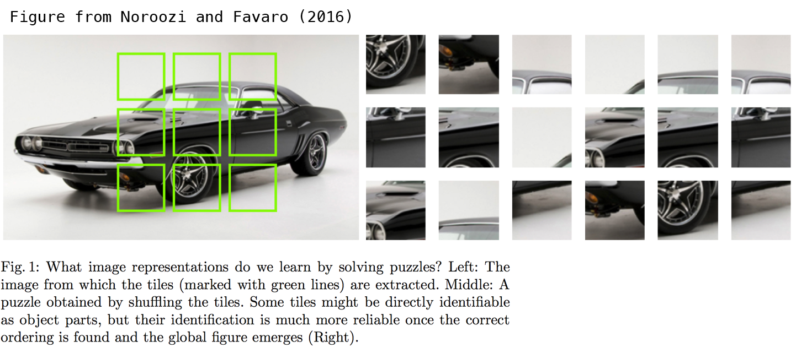
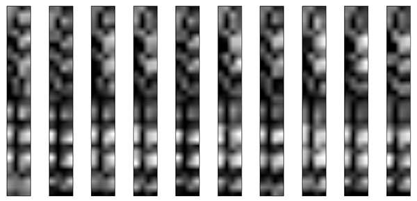
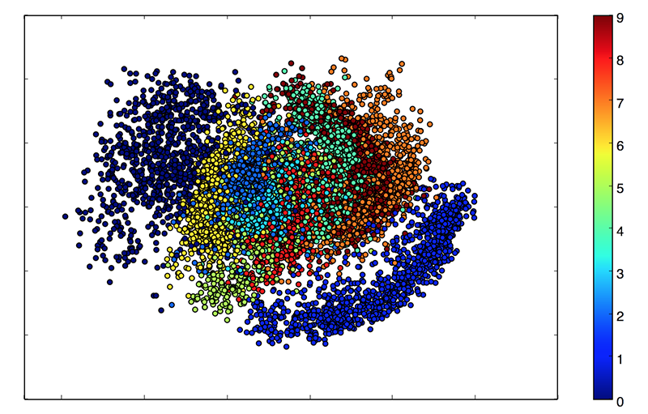
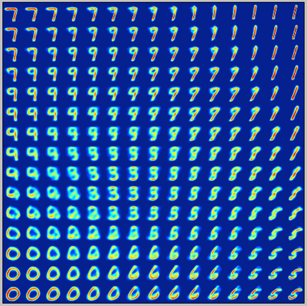

# 自动编码器：各种各样的自动编码器

## 文章信息

<font color='#FF0000'>本文地址：[<font color='#FF0000'>http://blog.keras.io/building-autoencoders-in-keras.html</font>](http://blog.keras.io/building-autoencoders-in-keras.html)

本文作者：Francois Chollet
</font>

### 什么是自动编码器（Autoencoder）


自动编码器是一种数据的压缩算法，其中数据的压缩和解压缩函数是1）数据相关的,2）有损的，3）从样本中自动学习的。在大部分提到自动编码器的场合，压缩和解压缩的函数是通过神经网络实现的。

1）自动编码器是数据相关的（data-specific 或 data-dependent），这意味着自动编码器只能压缩那些与训练数据类似的数据。自编码器与一般的压缩算法，如MPEG-2，MP3等压缩算法不同，一般的通用算法只假设了数据是“图像”或“声音”，而没有指定是哪种图像或声音。比如，使用人脸训练出来的自动编码器在压缩别的图片，比如树木时性能很差，因为它学习到的特征是与人脸相关的。

2）自动编码器是有损的，意思是解压缩的输出与原来的输入相比是退化的，MP3，JPEG等压缩算法也是如此。这与无损压缩算法不同。

3）自动编码器是从数据样本中自动学习的，这意味着很容易对指定类的输入训练出一种特定的编码器，而不需要完成任何新工作。

搭建一个自动编码器需要完成下面三样工作：搭建编码器，搭建解码器，设定一个损失函数，用以衡量由于压缩而损失掉的信息。编码器和解码器一般都是参数化的方程，并关于损失函数可导，典型情况是使用神经网络。编码器和解码器的参数可以通过最小化损失函数而优化，例如SGD。

### 自编码器是一个好的数据压缩算法吗

通常情况下，使用自编码器做数据压缩，性能并不怎么样。以图片压缩为例，想要训练一个能和JPEG性能相提并论的自编码器非常困难，并且要达到这个性能，你还必须要把图片的类型限定在很小的一个范围内（例如JPEG不怎么行的某类图片）。自编码器依赖于数据的特性使得它在面对真实数据的压缩上并不可行，你只能在指定类型的数据上获得还可以的效果，但谁知道未来会有啥新需求？

### 那么，自编码器擅长做什么？

自编码器在实际应用中用的很少，2012年人们发现在卷积神经网络中使用自编码器做逐层预训练可以训练深度网络，但很快人们发现良好的初始化策略在训练深度网络上要比费劲的逐层预训练有效得多，2014年出现的Batch Normalization技术使得更深的网络也可以被有效训练，到了2015年底，通过使用残差学习（ResNet）我们基本上可以训练任意深度的神经网络。

目前自编码器的应用主要有两个方面，第一是数据去噪，第二是为进行可视化而降维。配合适当的维度和稀疏约束，自编码器可以学习到比PCA等技术更有意思的数据投影。

对于2D的数据可视化，[<font color='#FF0000'>t-SNE</font>](https://en.wikipedia.org/wiki/T-distributed_stochastic_neighbor_embedding)（读作tee-snee）或许是目前最好的算法，但通常还是需要原数据的维度相对低一些。所以，可视化高维数据的一个好办法是首先使用自编码器将维度降低到较低的水平（如32维），然后再使用t-SNE将其投影在2D平面上。Keras版本的t-SNE由Kyle McDonald实现了一下，放在了[<font color='#FF0000'>这里</font>](https://github.com/kylemcdonald/Parametric-t-SNE/blob/master/Parametric%20t-SNE%20(Keras).ipynb)，另外[<font color='#FF0000'>scikit-learn</font>](http://scikit-learn.org/stable/modules/generated/sklearn.manifold.TSNE.html)也有一个简单实用的实现。

### 自编码器有什么卵用

自编码器的出名来自于网上很多机器学习课程的介绍，总而言之，一堆新手非常热爱自编码器而且怎么也玩不够，这就是这篇文章出现的意义【告诉你自编码器有什么卵用】。

自编码器吸引了一大批研究和关注的主要原因之一是很长时间一段以来它被认为是解决无监督学习的可能方案，即大家觉得自编码器可以在没有标签的时候学习到数据的有用表达。再说一次，自编码器并不是一个真正的无监督学习的算法，而是一个自监督的算法。自监督学习是监督学习的一个实例，其标签产生自输入数据。要获得一个自监督的模型，你需要想出一个靠谱的目标跟一个损失函数，问题来了，仅仅把目标设定为重构输入可能不是正确的选项。基本上，要求模型在像素级上精确重构输入不是机器学习的兴趣所在，学习到高级的抽象特征才是。事实上，当你的主要任务是分类、定位之类的任务时，那些对这类任务而言的最好的特征基本上都是重构输入时的最差的那种特征。

在应用自监督学习的视觉问题中，可能应用自编码器的领域有例如拼图，细节纹理匹配（从低分辨率的图像块中匹配其高分辨率的对应块）。下面这篇文章研究了拼图问题，其实很有意思，不妨一读。[<font color='#FF0000'>Unsupervised Learning of Visual Representations by Solving Jigsaw Puzzles.</font>](http://arxiv.org/abs/1603.09246)。此类问题的模型输入有些内置的假设，例如“视觉块比像素级的细节更重要”这样的，这种假设是普通的自编码器没有的。



### 使用Keras建立简单的自编码器

首先，先建立一个全连接的编码器和解码器

```python
from keras.layers import Input, Dense
from keras.models import Model

# this is the size of our encoded representations
encoding_dim = 32  # 32 floats -> compression of factor 24.5, assuming the input is 784 floats

# this is our input placeholder
input_img = Input(shape=(784,))
# "encoded" is the encoded representation of the input
encoded = Dense(encoding_dim, activation='relu')(input_img)
# "decoded" is the lossy reconstruction of the input
decoded = Dense(784, activation='sigmoid')(encoded)

# this model maps an input to its reconstruction
autoencoder = Model(input=input_img, output=decoded)
```

当然我们可以单独的使用编码器和解码器：

```python
# this model maps an input to its encoded representation
encoder = Model(input=input_img, output=encoded)
```

```python
# create a placeholder for an encoded (32-dimensional) input
encoded_input = Input(shape=(encoding_dim,))
# retrieve the last layer of the autoencoder model
decoder_layer = autoencoder.layers[-1]
# create the decoder model
decoder = Model(input=encoded_input, output=decoder_layer(encoded_input))
```

下面我们训练自编码器，来重构MNIST中的数字，这里使用逐像素的交叉熵作为损失函数，优化器为adam

```python
autoencoder.compile(optimizer='adadelta', loss='binary_crossentropy')
```

然后准备MNIST数据，将其归一化和向量化，然后训练：

```python
from keras.datasets import mnist
import numpy as np
(x_train, _), (x_test, _) = mnist.load_data()

x_train = x_train.astype('float32') / 255.
x_test = x_test.astype('float32') / 255.
x_train = x_train.reshape((len(x_train), np.prod(x_train.shape[1:])))
x_test = x_test.reshape((len(x_test), np.prod(x_test.shape[1:])))
print x_train.shape
print x_test.shape

autoencoder.fit(x_train, x_train,
                nb_epoch=50,
                batch_size=256,
                shuffle=True,
                validation_data=(x_test, x_test))
```

50个epoch后，看起来我们的自编码器优化的不错了，损失是0.10，我们可视化一下重构出来的输出：

```python
# encode and decode some digits
# note that we take them from the *test* set
# use Matplotlib (don't ask)
import matplotlib.pyplot as plt

encoded_imgs = encoder.predict(x_test)
decoded_imgs = decoder.predict(encoded_imgs)


n = 10  # how many digits we will display
plt.figure(figsize=(20, 4))
for i in range(n):
    # display original
    ax = plt.subplot(2, n, i)
    plt.imshow(x_test[i].reshape(28, 28))
    plt.gray()
    ax.get_xaxis().set_visible(False)
    ax.get_yaxis().set_visible(False)

    # display reconstruction
    ax = plt.subplot(2, n, i + n)
    plt.imshow(decoded_imgs[i].reshape(28, 28))
    plt.gray()
    ax.get_xaxis().set_visible(False)
    ax.get_yaxis().set_visible(False)
plt.show()
```

这里是结果：


### 稀疏自编码器：为码字加上稀疏性约束

刚刚我们的隐层有32个神经元，这种情况下，一般而言自编码器学到的是PCA的一个近似（PCA不想科普了）。但是如果我们对隐层单元施加稀疏性约束的话，会得到更为紧凑的表达，只有一小部分神经元会被激活。在Keras中，我们可以通过添加一个activity_regularizer达到对某层激活值进行约束的目的：

```python
from keras import regularizers

encoding_dim = 32

input_img = Input(shape=(784,))
# add a Dense layer with a L1 activity regularizer
encoded = Dense(encoding_dim, activation='relu',
                activity_regularizer=regularizers.activity_l1(10e-5))(input_img)
decoded = Dense(784, activation='sigmoid')(encoded)

autoencoder = Model(input=input_img, output=decoded)
```

因为我们添加了正则性约束，所以模型过拟合的风险降低，我们可以训练多几次，这次训练100个epoch，得到损失为0.11，多出来的0.01基本上是由于正则项造成的。可视化结果如下：


结果上没有毛线差别，区别在于编码出来的码字更加稀疏了。稀疏自编码器的在10000个测试图片上的码字均值为3.33，而之前的为7.30

### 深度自编码器：把自编码器叠起来

把多个自编码器叠起来，像这样：
```python
input_img = Input(shape=(784,))
encoded = Dense(128, activation='relu')(input_img)
encoded = Dense(64, activation='relu')(encoded)
encoded = Dense(32, activation='relu')(encoded)

decoded = Dense(64, activation='relu')(encoded)
decoded = Dense(128, activation='relu')(decoded)
decoded = Dense(784, activation='sigmoid')(decoded)

autoencoder = Model(input=input_img, output=decoded)
autoencoder.compile(optimizer='adadelta', loss='binary_crossentropy')

autoencoder.fit(x_train, x_train,
                nb_epoch=100,
                batch_size=256,
                shuffle=True,
                validation_data=(x_test, x_test))
```

100个epoch后，loss大概是0.097，比之前的模型好那么一丢丢


### 卷积自编码器：用卷积层搭建自编码器

当输入是图像时，使用卷积神经网络基本上总是有意义的。在现实中，用于处理图像的自动编码器几乎都是卷积自动编码器——又简单又快，棒棒哒

卷积自编码器的编码器部分由卷积层和MaxPooling层构成，MaxPooling负责空域下采样。而解码器由卷积层和上采样层构成。

```python
from keras.layers import Input, Dense, Convolution2D, MaxPooling2D, UpSampling2D
from keras.models import Model

input_img = Input(shape=(1, 28, 28))

x = Convolution2D(16, 3, 3, activation='relu', border_mode='same')(input_img)
x = MaxPooling2D((2, 2), border_mode='same')(x)
x = Convolution2D(8, 3, 3, activation='relu', border_mode='same')(x)
x = MaxPooling2D((2, 2), border_mode='same')(x)
x = Convolution2D(8, 3, 3, activation='relu', border_mode='same')(x)
encoded = MaxPooling2D((2, 2), border_mode='same')(x)

# at this point the representation is (8, 4, 4) i.e. 128-dimensional

x = Convolution2D(8, 3, 3, activation='relu', border_mode='same')(encoded)
x = UpSampling2D((2, 2))(x)
x = Convolution2D(8, 3, 3, activation='relu', border_mode='same')(x)
x = UpSampling2D((2, 2))(x)
x = Convolution2D(16, 3, 3, activation='relu')(x)
x = UpSampling2D((2, 2))(x)
decoded = Convolution2D(1, 3, 3, activation='sigmoid', border_mode='same')(x)

autoencoder = Model(input_img, decoded)
autoencoder.compile(optimizer='adadelta', loss='binary_crossentropy')
```

我们使用28*28*3的原始MNIST图像（尽管看起来还是灰度图）训练网络，图片的像素被归一化到0~1之间。

```python
from keras.datasets import mnist
import numpy as np

(x_train, _), (x_test, _) = mnist.load_data()

x_train = x_train.astype('float32') / 255.
x_test = x_test.astype('float32') / 255.
x_train = np.reshape(x_train, (len(x_train), 1, 28, 28))
x_test = np.reshape(x_test, (len(x_test), 1, 28, 28))
```

为了可视化训练过程的损失情况，我们使用TensorFlow作为后端，这样就可以启用TensorBoard了。打开一个终端并启动TensorBoard，TensorBoard将读取位于/tmp/autoencoder的日志文件：

```python
tensorboard --logdir=/tmp/autoencoder
```

然后我们把模型训练50个epoch，并在回调函数列表中传入TensorBoard回调函数，在每个epoch后回调函数将把训练的信息写入刚才的那个日志文件里，并被TensorBoard读取到
```python
from keras.callbacks import TensorBoard

autoencoder.fit(x_train, x_train,
                nb_epoch=50,
                batch_size=128,
                shuffle=True,
                validation_data=(x_test, x_test),
                callbacks=[TensorBoard(log_dir='/tmp/autoencoder')])
```

打开浏览器进入http://0.0.0.0:6006观测结果：


模型最后的loss是0.094，要比之前的模型都要好得多，因为现在我们的编码器的表达表达能力更强了。

```python
decoded_imgs = autoencoder.predict(x_test)

n = 10
plt.figure(figsize=(20, 4))
for i in range(n):
    # display original
    ax = plt.subplot(2, n, i)
    plt.imshow(x_test[i].reshape(28, 28))
    plt.gray()
    ax.get_xaxis().set_visible(False)
    ax.get_yaxis().set_visible(False)

    # display reconstruction
    ax = plt.subplot(2, n, i + n)
    plt.imshow(decoded_imgs[i].reshape(28, 28))
    plt.gray()
    ax.get_xaxis().set_visible(False)
    ax.get_yaxis().set_visible(False)
plt.show()
```


我们也可以看看中间的码字长什么样，这些码字的shape是8*4*4，我们可以将其reshape成4*32看

```python
n = 10
plt.figure(figsize=(20, 8))
for i in range(n):
    ax = plt.subplot(1, n, i)
    plt.imshow(encoded_imgs[i].reshape(4, 4 * 8).T)
    plt.gray()
    ax.get_xaxis().set_visible(False)
    ax.get_yaxis().set_visible(False)
plt.show()
```



### 使用自动编码器进行图像去噪

我们把训练样本用噪声污染，然后使解码器解码出干净的照片，以获得去噪自动编码器。首先我们把原图片加入高斯噪声，然后把像素值clip到0~1

```python
from keras.datasets import mnist
import numpy as np

(x_train, _), (x_test, _) = mnist.load_data()

x_train = x_train.astype('float32') / 255.
x_test = x_test.astype('float32') / 255.
x_train = np.reshape(x_train, (len(x_train), 1, 28, 28))
x_test = np.reshape(x_test, (len(x_test), 1, 28, 28))

noise_factor = 0.5
x_train_noisy = x_train + noise_factor * np.random.normal(loc=0.0, scale=1.0, size=x_train.shape) 
x_test_noisy = x_test + noise_factor * np.random.normal(loc=0.0, scale=1.0, size=x_test.shape) 

x_train_noisy = np.clip(x_train_noisy, 0., 1.)
x_test_noisy = np.clip(x_test_noisy, 0., 1.)
```

我们可以先看看被污染的照片长啥样：


和之前的卷积自动编码器相比，为了提高重构图质量，我们的模型稍有不同

```python
input_img = Input(shape=(1, 28, 28))

x = Convolution2D(32, 3, 3, activation='relu', border_mode='same')(input_img)
x = MaxPooling2D((2, 2), border_mode='same')(x)
x = Convolution2D(32, 3, 3, activation='relu', border_mode='same')(x)
encoded = MaxPooling2D((2, 2), border_mode='same')(x)

# at this point the representation is (32, 7, 7)

x = Convolution2D(32, 3, 3, activation='relu', border_mode='same')(encoded)
x = UpSampling2D((2, 2))(x)
x = Convolution2D(32, 3, 3, activation='relu', border_mode='same')(x)
x = UpSampling2D((2, 2))(x)
decoded = Convolution2D(1, 3, 3, activation='sigmoid', border_mode='same')(x)

autoencoder = Model(input_img, decoded)
autoencoder.compile(optimizer='adadelta', loss='binary_crossentropy')
```

先来100个epoch的训练看看结果

```python
autoencoder.fit(x_train_noisy, x_train,
                nb_epoch=100,
                batch_size=128,
                shuffle=True,
                validation_data=(x_test_noisy, x_test),
                callbacks=[TensorBoard(log_dir='/tmp/tb', histogram_freq=0, write_graph=False)])
```

结果如下，棒棒哒~


如果你将这个过程扩展到更大的卷积网络，你可以处理文档和声音的去噪，Kaggle有一个或许你会感兴趣的数据集在[<font color='#FF0000'>这里</font>](https://www.kaggle.com/c/denoising-dirty-documents)

### 序列到序列的自动编码器

如果你的输入是序列而不是2D的图像，那么你可能想要使用针对序列的模型构造自编码器，如LSTM。要构造基于LSTM的自编码器，首先我们需要一个LSTM的编码器来将输入序列变为一个向量，然后将这个向量重复N此，然后用LSTM的解码器将这个N步的时间序列变为目标序列。

这里我们不针对任何特定的数据库做这件事，只提供代码供读者参考

```python
from keras.layers import Input, LSTM, RepeatVector
from keras.models import Model

inputs = Input(shape=(timesteps, input_dim))
encoded = LSTM(latent_dim)(inputs)

decoded = RepeatVector(timesteps)(encoded)
decoded = LSTM(input, return_sequences=True)(decoded)

sequence_autoencoder = Model(inputs, decoded)
encoder = Model(inputs, encoded)
```

### 变分自编码器（Variational autoencoder，VAE）：编码数据的分布

编码自编码器是更现代和有趣的一种自动编码器，它为码字施加约束，使得编码器学习到输入数据的隐变量模型。隐变量模型是连接显变量集和隐变量集的统计模型，隐变量模型的假设是显变量是由隐变量的状态控制的，各个显变量之间条件独立。也就是说，变分编码器不再学习一个任意的函数，而是学习你的数据概率分布的一组参数。通过在这个概率分布中采样，你可以生成新的输入数据，即变分编码器是一个生成模型。

下面是变分编码器的工作原理：

首先，编码器网络将输入样本x转换为隐空间的两个参数，记作z_mean和z_log_sigma。然后，我们随机从隐藏的正态分布中采样得到数据点z，这个隐藏分布我们假设就是产生输入数据的那个分布。z = z_mean + exp(z_log_sigma)*epsilon，epsilon是一个服从正态分布的张量。最后，使用解码器网络将隐空间映射到显空间，即将z转换回原来的输入数据空间。

参数藉由两个损失函数来训练，一个是重构损失函数，该函数要求解码出来的样本与输入的样本相似（与之前的自编码器相同），第二项损失函数是学习到的隐分布与先验分布的KL距离，作为一个正则。实际上把后面这项损失函数去掉也可以，尽管它对学习符合要求的隐空间和防止过拟合有帮助。

因为VAE是一个很复杂的例子，我们把VAE的代码放在了github上，在[<font color='#FF0000'>这里</font>](https://github.com/fchollet/keras/blob/master/examples/variational_autoencoder.py)。在这里我们来一步步回顾一下这个模型是如何搭建的

首先，建立编码网络，将输入影射为隐分布的参数：

```python
x = Input(batch_shape=(batch_size, original_dim))
h = Dense(intermediate_dim, activation='relu')(x)
z_mean = Dense(latent_dim)(h)
z_log_sigma = Dense(latent_dim)(h)
```

然后从这些参数确定的分布中采样，这个样本相当于之前的隐层值

```python
def sampling(args):
    z_mean, z_log_sigma = args
    epsilon = K.random_normal(shape=(batch_size, latent_dim),
                              mean=0., std=epsilon_std)
    return z_mean + K.exp(z_log_sigma) * epsilon

# note that "output_shape" isn't necessary with the TensorFlow backend
# so you could write `Lambda(sampling)([z_mean, z_log_sigma])`
z = Lambda(sampling, output_shape=(latent_dim,))([z_mean, z_log_sigma])
```

最后，将采样得到的点映射回去重构原输入：

```python
decoder_h = Dense(intermediate_dim, activation='relu')
decoder_mean = Dense(original_dim, activation='sigmoid')
h_decoded = decoder_h(z)
x_decoded_mean = decoder_mean(h_decoded)
```

到目前为止我们做的工作需要实例化三个模型：

* 一个端到端的自动编码器，用于完成输入信号的重构

* 一个用于将输入空间映射为隐空间的编码器

* 一个利用隐空间的分布产生的样本点生成对应的重构样本的生成器

```python
# end-to-end autoencoder
vae = Model(x, x_decoded_mean)

# encoder, from inputs to latent space
encoder = Model(x, z_mean)

# generator, from latent space to reconstructed inputs
decoder_input = Input(shape=(latent_dim,))
_h_decoded = decoder_h(decoder_input)
_x_decoded_mean = decoder_mean(_h_decoded)
generator = Model(decoder_input, _x_decoded_mean)
```

我们使用端到端的模型训练，损失函数是一项重构误差，和一项KL距离

```python
def vae_loss(x, x_decoded_mean):
    xent_loss = objectives.binary_crossentropy(x, x_decoded_mean)
    kl_loss = - 0.5 * K.mean(1 + z_log_sigma - K.square(z_mean) - K.exp(z_log_sigma), axis=-1)
    return xent_loss + kl_loss

vae.compile(optimizer='rmsprop', loss=vae_loss)
```

现在使用MNIST库来训练变分编码器：

```python
(x_train, y_train), (x_test, y_test) = mnist.load_data()

x_train = x_train.astype('float32') / 255.
x_test = x_test.astype('float32') / 255.
x_train = x_train.reshape((len(x_train), np.prod(x_train.shape[1:])))
x_test = x_test.reshape((len(x_test), np.prod(x_test.shape[1:])))

vae.fit(x_train, x_train,
        shuffle=True,
        nb_epoch=nb_epoch,
        batch_size=batch_size,
        validation_data=(x_test, x_test))
```

因为我们的隐空间只有两维，所以我们可以可视化一下。我们来看看2D平面中不同类的近邻分布：

```python
x_test_encoded = encoder.predict(x_test, batch_size=batch_size)
plt.figure(figsize=(6, 6))
plt.scatter(x_test_encoded[:, 0], x_test_encoded[:, 1], c=y_test)
plt.colorbar()
plt.show()
```



上图每种颜色代表一个数字，相近聚类的数字代表他们在结构上相似。

因为变分编码器是一个生成模型，我们可以用它来生成新数字。我们可以从隐平面上采样一些点，然后生成对应的显变量，即MNIST的数字：

```python
# display a 2D manifold of the digits
n = 15  # figure with 15x15 digits
digit_size = 28
figure = np.zeros((digit_size * n, digit_size * n))
# we will sample n points within [-15, 15] standard deviations
grid_x = np.linspace(-15, 15, n)
grid_y = np.linspace(-15, 15, n)

for i, yi in enumerate(grid_x):
    for j, xi in enumerate(grid_y):
        z_sample = np.array([[xi, yi]]) * epsilon_std
        x_decoded = generator.predict(z_sample)
        digit = x_decoded[0].reshape(digit_size, digit_size)
        figure[i * digit_size: (i + 1) * digit_size,
               j * digit_size: (j + 1) * digit_size] = digit

plt.figure(figsize=(10, 10))
plt.imshow(figure)
plt.show()
```



OK这就是本文的全部，如果你觉得本文还可以增加点别的主题，可以在Twitter上@fchollet

### 参考文献

* [<font color='#FF0000'>[1] Why does unsupervised pre-training help deep learning?</font>](http://www.jmlr.org/papers/volume11/erhan10a/erhan10a.pdf)

* [<font color='#FF0000'>[2] Batch normalization: Accelerating deep network training by reducing internal covariate shift.</font>](http://arxiv.org/abs/1502.03167)

* [<font color='#FF0000'>[3] Deep Residual Learning for Image Recognition</font>](http://arxiv.org/abs/1512.03385)

* [<font color='#FF0000'>[4] Auto-Encoding Variational Bayes</font>](http://arxiv.org/abs/1312.6114)
